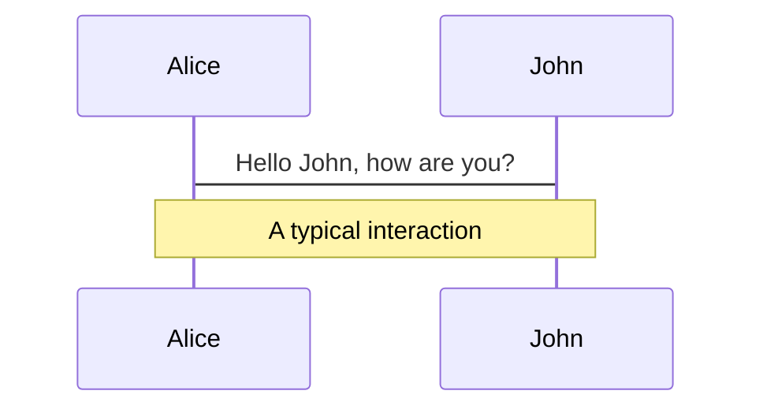
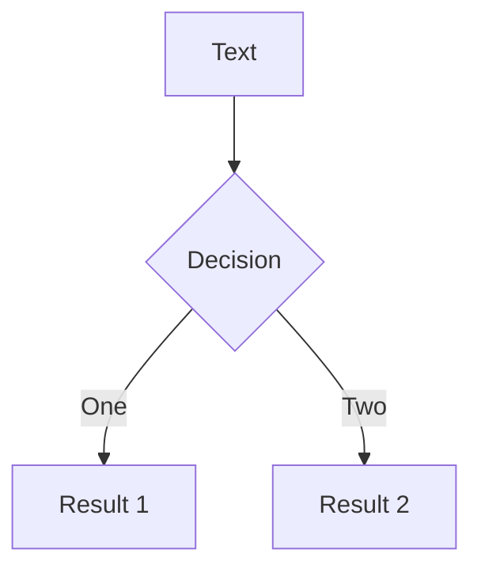
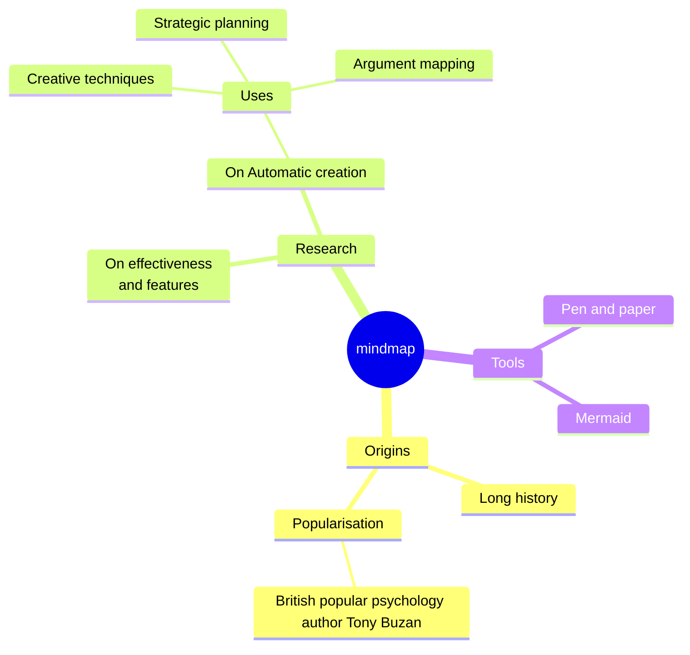
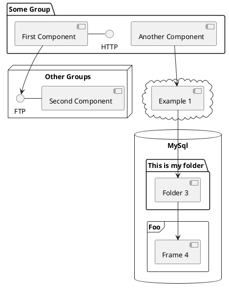

---
# You can also start simply with 'default'
theme: seriph
# random image from a curated Unsplash collection by Anthony
# like them? see https://unsplash.com/collections/94734566/slidev
background: https://cover.sli.dev
# some information about your slides (markdown enabled)
title: Welcome to Slidev
info: |
  ## Slidev Starter Template
  Presentation slides for developers.

  Learn more at [Sli.dev](https://sli.dev)
# apply unocss classes to the current slide
class: text-center
# https://sli.dev/custom/highlighters.html
highlighter: shiki
# https://sli.dev/guide/drawing
drawings:
  persist: false
# slide transition: https://sli.dev/guide/animations#slide-transitions
transition: slide-left
# enable MDC Syntax: https://sli.dev/guide/syntax#mdc-syntax
mdc: true
---

# 欢迎来到网页设计

---

# 点个名先

---

# 自我介绍

## 杨清 石狮鹏山工贸学校

- 📝 **杭州师范大学** - 教育技术学 研究生
- **自学前端三件套** - HTML、CSS、Javascript
- 会 前端、后端、AI、虚拟现实，还有游戏开发

<br>
<br>

<!-- Read more about [Why Slidev?](https://sli.dev/guide/why) -->

<!--
You can have `style` tag in markdown to override the style for the current page.
Learn more: https://sli.dev/guide/syntax#embedded-styles
-->

<style>
h1 {
  background-color: #2B90B6;
  background-image: linear-gradient(45deg, #4EC5D4 10%, #146b8c 20%);
  background-size: 100%;
  -webkit-background-clip: text;
  -moz-background-clip: text;
  -webkit-text-fill-color: transparent;
  -moz-text-fill-color: transparent;
}
</style>

---

# 授课要求

### 1. 不要扰乱课堂纪律，包括迟到早退

### 2. 不要在机房吃零食（喝水可以）

### 3. 小组为单位，乐于分享

<div v-click>遵守以上要求，有什么好处？</div>

<div v-click>### - 基本不会留作业，或者是作业都能在课上完成</div>

<div v-click>### - 有留多余时间的话，老师带你们 “玩” 些业界前沿的技术（包括AI生成）</div>
<div v-click>(就算是来不及搞这些，也可以给大家讲讲我去腾讯、网易的经历，或者是技术圈近期的一些趣事)
<p v-after class="absolute bottom-45 left-90 opacity-30 transform -rotate-10">都是些课堂上学不到的新玩意儿！</p>
</div>

---

```yaml
layout: image-right
image: https://cover.sli.dev
```

# 网站和网页

今日任务：认识网页的本质（教材 p2 - p6）

- 了解网页和网站的相关知识
- 了解 HTML 的基本知识和作用

---

# 生活中常见的网页

请同学们发言

<div v-click>网页的本质是什么？</div>

<div v-click><p v-after class="absolute bottom-70 left-70 opacity-50 transform -rotate-20">app?</p></div>
<p v-after class="absolute bottom-70 left-30 opacity-30 transform -rotate-10">应用程序？</p>
<p v-after class="absolute bottom-70 left-90 opacity-30 transform -rotate-30">浏览器？</p>

<div v-click>答案是超文本标记语言！</div>

---

# 网页的实质（知识链接1）

## 由**超文本标记语言**（Hyper Text Markup Language，HTML）编写的**文本文件**

#

### 超文本标记语言的核心思想：**标签化**（知识链接3）

---

```yaml
layout: default
calss: gap-2
```
# 标签化
每一行都有其意义！

基本格式：
```
<标签名>标签内容</标签名>
```
或者
```
<标签名 属性名=属性值>
  标签内容
</标签名>
```
程序只认**标签**，标签必须一行，内容可以**换行**

```
<标签名 
  属性名=属性值>标签内容
</标签名>
```
上面这种就不行了！

---

# 标签化
每一行都有其意义！
<div grid="~ cols-2 gap-4">
<div>

```html {all|1|2|3|4|5|6|7|8|9|10|1-10|3-5|all} twoslash
<html>
<!--文档头部-->
<head>
<title>我的定义一个网页</title>
</head>
<!--文档主体-->
<body bgcolor=yellow text=red>
<h1> 芝士我制作的第一个网页 </h1>
<p>嘿！大家好！</p>
</body>
</html>
```
</div>
<div>

- `<html>` :标记文档的开始和结束，其他所有标签都得包含在html里面！
- `<head>` ：标记文档头的开始和结束
- `<title>` ：设置文档的标题
- `<body>` ：主体标签
- `<p>` ：标记一段的开始和结束
- `<h1>` ：说明其文字是一级标题
* p和h1可以不加```</标签名>```作为尾巴，但是初次使用不推荐这样做

</div>
</div>
---

```yaml
layout: image-right
image: https://preview.redd.it/nj999c0w55931.png?width=2300&format=png&auto=webp&s=8a5fed6351ff8fde9ffe1a0a238897ef568aec64
```

# 网页开发平台

## Visual Studio Code

简称VScode，微软出品
- 最常用的前端人员（臭做网页的）开发平台
- 有众多插件和可使用
- 一个平台，可用于多种语言（HTML、Python、C#等）
- 但是需要有代码基础才能玩转

---

```yaml
layout: image-right
image: https://preview.redd.it/nj999c0w55931.png?width=2300&format=png&auto=webp&s=8a5fed6351ff8fde9ffe1a0a238897ef568aec64
```

# 网页开发平台

## Adobe Dreamweaver CS6

简称DW，Adobe公司出品

- 可视化网页设计平台
- 曾经的“网页三剑客”（DW、Fireworks、Flash）
- 无需代码基础，适合新手

考虑到 VScode 上手难度较大，我们这节课还是用 DW 为主，不过也推荐感兴趣的同学自己下载个 VScode 尝鲜

<style>
.footnotes-sep {
  @apply mt-5 opacity-10;
}
.footnotes {
  @apply text-sm opacity-75;
}
.footnote-backref {
  display: none;
}
</style>

<!--
Notes can also sync with clicks

[click] This will be highlighted after the first click

[click] Highlighted with `count = ref(0)`

[click:3] Last click (skip two clicks)
-->

---

# Table of contents

You can use the `Toc` component to generate a table of contents for your slides:

```html
<Toc minDepth="1" maxDepth="1"></Toc>
```

The title will be inferred from your slide content, or you can override it with `title` and `level` in your frontmatter.

::right::

<Toc v-click minDepth="1" maxDepth="2"></Toc>

---

```yaml
layout: image-right
image: https://cover.sli.dev
```

# Code

Use code snippets and get the highlighting directly, and even types hover![^1]

```ts {all|5|7|7-8|10|all} twoslash
// TwoSlash enables TypeScript hover information
// and errors in markdown code blocks
// More at https://shiki.style/packages/twoslash

import { computed, ref } from 'vue'

const count = ref(0)
const doubled = computed(() => count.value * 2)

doubled.value = 2
```

<arrow v-click="[4, 5]" x1="350" y1="310" x2="195" y2="334" color="#953" width="2" arrowSize="1" />

<!-- This allow you to embed external code blocks -->

<<< @/snippets/external.ts#snippet

<!-- Footer -->

[^1]: [Learn More](https://sli.dev/guide/syntax.html#line-highlighting)

<!-- Inline style -->
<style>
.footnotes-sep {
  @apply mt-5 opacity-10;
}
.footnotes {
  @apply text-sm opacity-75;
}
.footnote-backref {
  display: none;
}
</style>

<!--
Notes can also sync with clicks

[click] This will be highlighted after the first click

[click] Highlighted with `count = ref(0)`

[click:3] Last click (skip two clicks)
-->

---

## level: 2

# Shiki Magic Move

Powered by [shiki-magic-move](https://shiki-magic-move.netlify.app/), Slidev supports animations across multiple code snippets.

Add multiple code blocks and wrap them with <code>````md magic-move</code> (four backticks) to enable the magic move. For example:

````md magic-move {lines: true}
```ts {*|2|*}
// step 1
const author = reactive({
  name: 'John Doe',
  books: [
    'Vue 2 - Advanced Guide',
    'Vue 3 - Basic Guide',
    'Vue 4 - The Mystery'
  ]
})
```

```ts {*|1-2|3-4|3-4,8}
// step 2
export default {
  data() {
    return {
      author: {
        name: 'John Doe',
        books: [
          'Vue 2 - Advanced Guide',
          'Vue 3 - Basic Guide',
          'Vue 4 - The Mystery'
        ]
      }
    }
  }
}
```

```ts
// step 3
export default {
  data: () => ({
    author: {
      name: 'John Doe',
      books: [
        'Vue 2 - Advanced Guide',
        'Vue 3 - Basic Guide',
        'Vue 4 - The Mystery'
      ]
    }
  })
}
```

Non-code blocks are ignored.

```vue
<!-- step 4 -->
<script setup>
const author = {
  name: 'John Doe',
  books: [
    'Vue 2 - Advanced Guide',
    'Vue 3 - Basic Guide',
    'Vue 4 - The Mystery'
  ]
}
</script>
```
````

---

# Components

<div grid="~ cols-2 gap-4">
<div>

You can use Vue components directly inside your slides.

We have provided a few built-in components like `<Tweet/>` and `<Youtube/>` that you can use directly. And adding your custom components is also super easy.

```html
<Counter :count="10" />
```

<!-- ./components/Counter.vue -->
<Counter :count="10" m="t-4" />

Check out [the guides](https://sli.dev/builtin/components.html) for more.

</div>
<div>

```html
<Tweet id="1390115482657726468" />
```

<Tweet id="1390115482657726468" scale="0.65" />

</div>
</div>

<!--
Presenter note with **bold**, *italic*, and ~~striked~~ text.

Also, HTML elements are valid:
<div class="flex w-full">
  <span style="flex-grow: 1;">Left content</span>
  <span>Right content</span>
</div>
-->

---

## class: px-20

# Themes

Slidev comes with powerful theming support. Themes can provide styles, layouts, components, or even configurations for tools. Switching between themes by just **one edit** in your frontmatter:

<div grid="~ cols-2 gap-2" m="t-2">

```yaml
---
theme: default
---
```

```yaml
---
theme: seriph
---
```


</div>

Read more about [How to use a theme](https://sli.dev/themes/use.html) and
check out the [Awesome Themes Gallery](https://sli.dev/themes/gallery.html).

---

# Clicks Animations

You can add `v-click` to elements to add a click animation.

<div v-click>

This shows up when you click the slide:

```html
<div v-click>This shows up when you click the slide.</div>
```

</div>

<br>

<v-click>

The <span v-mark.red="3"><code>v-mark</code> directive</span>
also allows you to add
<span v-mark.circle.orange="4">inline marks</span>
, powered by [Rough Notation](https://roughnotation.com/):

```html
<span v-mark.underline.orange>inline markers</span>
```

</v-click>

<div mt-20 v-click>

[Learn More](https://sli.dev/guide/animations#click-animations)

</div>

---

# Motions

Motion animations are powered by [@vueuse/motion](https://motion.vueuse.org/), triggered by `v-motion` directive.

```html
<div
  v-motion
  :initial="{ x: -80 }"
  :enter="{ x: 0 }"
  :click-3="{ x: 80 }"
  :leave="{ x: 1000 }"
>
  Slidev
</div>
```

<div class="w-60 relative">
  <div class="relative w-40 h-40">
    
    
    
  </div>

  <div
    class="text-5xl absolute top-14 left-40 text-[#2B90B6] -z-1"
    v-motion
    :initial="{ x: -80, opacity: 0}"
    :enter="{ x: 0, opacity: 1, transition: { delay: 2000, duration: 1000 } }">
    Slidev
  </div>
</div>

<!-- vue script setup scripts can be directly used in markdown, and will only affects current page -->
<script setup lang="ts">
const final = {
  x: 0,
  y: 0,
  rotate: 0,
  scale: 1,
  transition: {
    type: 'spring',
    damping: 10,
    stiffness: 20,
    mass: 2
  }
}
</script>

<div
  v-motion
  :initial="{ x:35, y: 30, opacity: 0}"
  :enter="{ y: 0, opacity: 1, transition: { delay: 3500 } }">

[Learn More](https://sli.dev/guide/animations.html#motion)

</div>

---

# LaTeX

LaTeX is supported out-of-box. Powered by [KaTeX](https://katex.org/).

<div h-3 />

Inline $\sqrt{3x-1}+(1+x)^2$

Block

$$
{1|3|all}
\begin{aligned}
\nabla \cdot \vec{E} &= \frac{\rho}{\varepsilon_0} \\
\nabla \cdot \vec{B} &= 0 \\
\nabla \times \vec{E} &= -\frac{\partial\vec{B}}{\partial t} \\
\nabla \times \vec{B} &= \mu_0\vec{J} + \mu_0\varepsilon_0\frac{\partial\vec{E}}{\partial t}
\end{aligned}
$$

[Learn more](https://sli.dev/guide/syntax#latex)

---

# Diagrams

You can create diagrams / graphs from textual descriptions, directly in your Markdown.

<div class="grid grid-cols-4 gap-5 pt-4 -mb-6">









</div>

[Learn More](https://sli.dev/guide/syntax.html#diagrams)

---

foo: bar
dragPos:
square: 691,32,167,\_,-16

---

dragPos:
square: 0,-446,0,0

---

dragPos:
square: 0,-446,0,0

---

dragPos:
square: 0,-446,0,0

---

dragPos:
square: 0,-446,0,0

---

dragPos:
square: 0,-446,0,0

---

dragPos:
square: 0,-446,0,0

---

dragPos:
square: 0,-446,0,0

---

dragPos:
square: 0,-446,0,0

---
dragPos:
  square: 0,-459,0,0
---

# Draggable Elements

Double-click on the draggable elements to edit their positions.

<br>

###### Directive Usage

```md

```

<br>

###### Component Usage

```md
<v-drag text-3xl>
  <carbon:arrow-up />
  Use the `v-drag` component to have a draggable container!
</v-drag>
```

<v-drag pos="663,206,261,_,-15"undefinedundefinedundefinedundefinedundefinedundefinedundefinedundefinedundefined>

  <div text-center text-3xl border border-main rounded>
    Double-click me!
  </div>
</v-drag>


###### Draggable Arrow

```md
<v-drag-arrow two-way />
```

<v-drag-arrow pos="67,452,253,46" two-way op70 />

---

src: ./pages/multiple-entries.md
hide: false

---


---

# Monaco Editor

Slidev provides built-in Monaco Editor support.

Add `{monaco}` to the code block to turn it into an editor:

```ts {monaco}
import { ref } from 'vue'
import { emptyArray } from './external'

const arr = ref(emptyArray(10))
```

Use `{monaco-run}` to create an editor that can execute the code directly in the slide:

```ts {monaco-run}
import { version } from 'vue'
import { emptyArray, sayHello } from './external'

sayHello()
console.log(`vue ${version}`)
console.log(emptyArray<number>(10).reduce(fib => [...fib, fib.at(-1)! + fib.at(-2)!], [1, 1]))
```

---

layout: center
class: text-center

---

# Learn More

[Documentation](https://sli.dev) · [GitHub](https://github.com/slidevjs/slidev) · [Showcases](https://sli.dev/showcases.html)

<PoweredBySlidev mt-10 />
