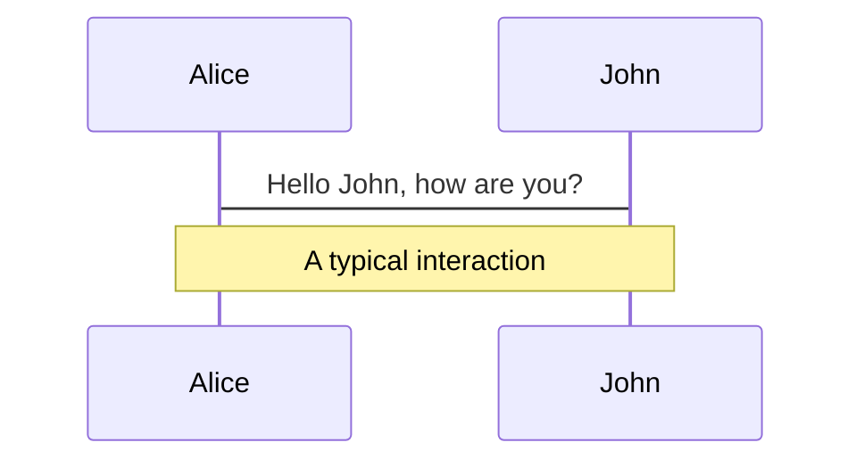
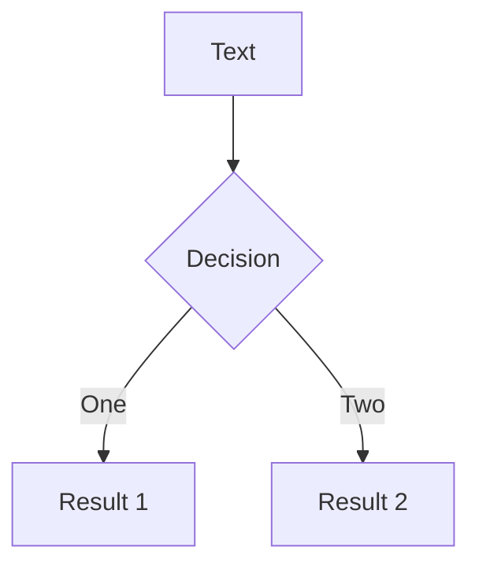
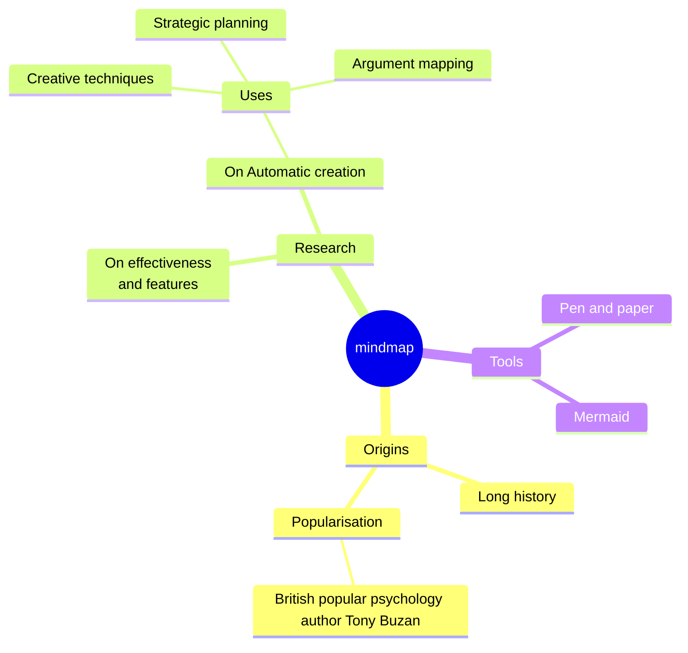
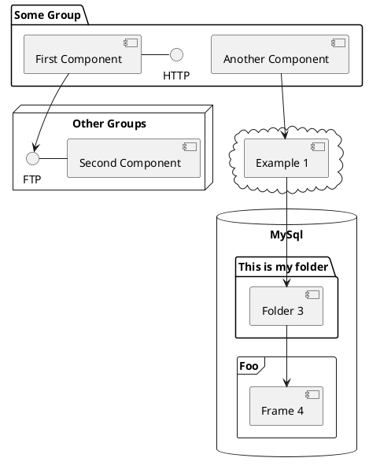

---
# You can also start simply with 'default'
theme: seriph
# random image from a curated Unsplash collection by Anthony
# like them? see https://unsplash.com/collections/94734566/slidev
background: https://cover.sli.dev
# some information about your slides (markdown enabled)
title: Welcome to Slidev
info: |
  ## Slidev Starter Template
  Presentation slides for developers.

  Learn more at [Sli.dev](https://sli.dev)
# apply unocss classes to the current slide
class: text-center
# https://sli.dev/custom/highlighters.html
highlighter: shiki
# https://sli.dev/guide/drawing
drawings:
  persist: false
# slide transition: https://sli.dev/guide/animations#slide-transitions
transition: slide-left
# enable MDC Syntax: https://sli.dev/guide/syntax#mdc-syntax
mdc: true
---

# 网页设计 多平台云课件
基于Slidev制作，页面由Netlify托管
石狮鹏山工贸学校 杨清

---

# 点个名先

---

# 自我介绍

## 杨清 石狮鹏山工贸学校

- 📝 **杭州师范大学** - 教育技术学 研究生
- **自学前端三件套** - HTML、CSS、Javascript
- 会 前端、后端、AI、虚拟现实，还有游戏开发

<br>
<br>

<!-- Read more about [Why Slidev?](https://sli.dev/guide/why) -->

<!--
You can have `style` tag in markdown to override the style for the current page.
Learn more: https://sli.dev/guide/syntax#embedded-styles
-->

<style>
h1 {
  background-color: #2B90B6;
  background-image: linear-gradient(45deg, #4EC5D4 10%, #146b8c 20%);
  background-size: 100%;
  -webkit-background-clip: text;
  -moz-background-clip: text;
  -webkit-text-fill-color: transparent;
  -moz-text-fill-color: transparent;
}
</style>

---

# 授课要求

### 1. 不要扰乱课堂纪律，包括迟到早退

### 2. 不要在机房吃零食（喝水可以）

### 3. 小组为单位，乐于分享

<div v-click>遵守以上要求，有什么好处？</div>

<div v-click>### - 基本不会留作业，或者是作业都能在课上完成</div>

<div v-click>### - 有留多余时间的话，老师带你们 “玩” 些业界前沿的技术（包括AI生成）</div>
<div v-click>(就算是来不及搞这些，也可以给大家讲讲我去腾讯、网易的经历，或者是技术圈近期的一些趣事)
<p v-after class="absolute bottom-45 left-90 opacity-30 transform -rotate-10">都是些课堂上学不到的新玩意儿！</p>
</div>

---

```yaml
layout: image-right
image: https://cover.sli.dev
```

# 网站和网页

今日任务：认识网页的本质（教材 p2 - p6）

- 了解网页和网站的相关知识
- 了解 HTML 的基本知识和作用

---

# 生活中常见的网页

请同学们发言

<div v-click>网页的本质是什么？</div>

<div v-click><p v-after class="absolute bottom-70 left-70 opacity-50 transform -rotate-20">app?</p></div>
<p v-after class="absolute bottom-70 left-30 opacity-30 transform -rotate-10">应用程序？</p>
<p v-after class="absolute bottom-70 left-90 opacity-30 transform -rotate-30">浏览器？</p>

<div v-click>答案是超文本标记语言！</div>

---

# 网页的实质（知识链接1）

## 由**超文本标记语言**（Hyper Text Markup Language，HTML）编写的**文本文件**

#

### 超文本标记语言的核心思想：**标签化**（知识链接3）

---

```yaml
layout: default
calss: gap-2
```
# 标签化
每一行都有其意义！

基本格式：
```
<标签名>标签内容</标签名>
```
或者
```
<标签名 属性名=属性值>
  标签内容
</标签名>
```
程序只认**标签**，标签必须一行，内容可以**换行**

```
<标签名 
  属性名=属性值>标签内容
</标签名>
```
上面这种就不行了！

---

# 标签化
每一行都有其意义！
<div grid="~ cols-2 gap-4">
<div>

```html {all|1|2|3|4|5|6|7|8|9|10|1-10|3-5|all} twoslash
<html>
<!--文档头部-->
<head>
<title>我的定义一个网页</title>
</head>
<!--文档主体-->
<body bgcolor=yellow text=red>
<h1> 芝士我制作的第一个网页 </h1>
<p>嘿！大家好！</p>
</body>
</html>
```
</div>
<div>

- `<html>` :标记文档的开始和结束，其他所有标签都得包含在html里面！
- `<head>` ：标记文档头的开始和结束
- `<title>` ：设置文档的标题
- `<body>` ：主体标签
- `<p>` ：标记一段的开始和结束
- `<h1>` ：说明其文字是一级标题
* p和h1可以不加```</标签名>```作为尾巴，但是初次使用不推荐这样做

</div>
</div>
---

```yaml
layout: image-right
image: https://obsidian-figbed-1257930702.cos.ap-guangzhou.myqcloud.com/202409080010029.png
```

# 网页开发平台

## Visual Studio Code

简称VScode，微软出品
- 最常用的前端人员（臭做网页的）开发平台
- 有众多插件和可使用
- 一个平台，可用于多种语言（HTML、Python、C#等）
- 但是需要有代码基础才能玩转

---

```yaml
layout: image-right
image: https://obsidian-figbed-1257930702.cos.ap-guangzhou.myqcloud.com/202409080008594.png
```

# 网页开发平台

## Adobe Dreamweaver CS6

简称DW，Adobe公司出品

- 可视化网页设计平台
- 曾经的“网页三剑客”（DW、Fireworks、Flash）
- 无需代码基础，适合新手

考虑到 VScode 上手难度较大，我们这节课还是用 DW 为主，不过也推荐感兴趣的同学自己下载个 VScode 尝鲜

<style>
.footnotes-sep {
  @apply mt-5 opacity-10;
}
.footnotes {
  @apply text-sm opacity-75;
}
.footnote-backref {
  display: none;
}
</style>

---

```yaml
layout: center
```

# 任务2 网站规划与设计

- 了解如何确定网站主题
- 了解如何构思网站的整体风格
- 了解如何规划和设计网页布局
- 了解如何规划网站的功能架构和板块结构

---

```yaml
layout: image-left
image: https://image.uisdc.com/wp-content/uploads/2022/12/Web-Design-20221226-2.jpg
```
## 网站设计原则：先模仿，再原创

刚起步的原创是走不远的，我们需要从身边的优秀案例学起

  <div v-click> 请以小组为单位，选择一个喜欢的网站，基于以下格式准备进行简单描述：
  （每组派一位代表）</div>
  <div v-click> - 网站的功能：用来干什么的？ </div>
  <div v-click> - 网站的定位：面向什么人的？ </div>
  <div v-click> - 风格和配色：用点形容词 </div>
  <div v-click> - 布局结构：可参考课本 图1-12 进行文字描述 </div>

---

# 网站一般设计流程（课本P11）

## 1. 确定网站定位
  - 理想的浏览者 + 符合浏览者“胃口”的内容
## 2. 网站的主题和名称
  - “域名”通常围绕这个取
## 3. 构思网站整体风格
  - 如果B站是一派政府网站的配色和布局，其点击量就大不如前
## 4. 确定网站的整体配色
  - 注意：课本P13的“安全色”现在已经不再需要了，只需要记住安全色一共“216”个就行，实际开发时大可随意发挥

---

```yaml
layout: image-right
image: https://www.aidaguan.com/wp-content/uploads/2023/05/%E8%AE%AF%E9%A3%9E%E6%98%9F%E7%81%AB%E8%AE%A4%E7%9F%A5%E5%A4%A7%E6%A8%A1%E5%9E%8B.png
```

# 设计流程资源推荐
来点课本上不教的，但是十分有九分好用的

### 确定网站定位、网站的主题和名称: AI生成式人工智能

国内推荐**讯飞星火**，和**清华智谱**

最近的豆包也行，不过讯飞星火是国内“AI天梯排位榜”榜首

---

```yaml
layout: image-left
image: https://meirisucai.com/uploads/20230318203622c1cc98177.jpg
```

# 设计流程资源推荐
来点课本上不教的，但是十分有九分好用的

### 布局结构
### Canvas可画

- 有上百个免费设计资源
- 自带在线设计程序，可以真 零代码设计
- 能快速生成平面设计原型，包括网页、海报等

（我们不用它上课的主要原因是这玩意大部分功能收费，而且有些功能不太稳定）

---

```yaml
layout: image-right
image: https://pic4.zhimg.com/v2-37bf82e85040db3ee42235bfb960c670_r.jpg?source=1940ef5c
```

# 设计流程资源推荐
来点课本上不教的，但是十分有九分好用的

### 配色方案
### 大部分配色方案在线提供网站

- 为你挑选好立刻可使用的配色方案，选择颜色时需要往里套就行

- 网站不止一个，感兴趣搜索“配色网站”即可
- https://www.zhihu.com/question/299730272

---

# 网站项目整体开发流程（课本第18页）

## 步骤一：需求分析

### 客户想要建设“上海企业网”，经过可行性分析讨论后，确定立项，并制作了一份客户需求说明书
```
- 可行性分析：
  可行性分析是一种综合性的系统分析方法，主要用于评估项目的可行性。
  通过对项目的市场需求、资源供应、建设规模、工艺路线、设备选型、环境影响、资金筹措、盈利能力等方面进行调查研究和分析比较，
  预测项目建成后的财务、经济效益及社会环境影响，
  从而提出项目是否值得投资和如何进行建设的咨询意见
```
```
- 客户需求说明书：
  也叫产品需求文档，通常采取功能罗列法，然后再让客户根据需求做减法。
  根据客户的需求，全部罗列出某模块的思维导图
```
---

# 网站项目整体开发流程（课本第18页）

## 步骤二：网站设计

  ### - 网站建设的目的和定位

  ### - 网站的整体风格和配色

  ### - 网站的布局设计

  ### - 网站的栏目板块规划

就是我们刚刚分享的内容

---

# 网站项目整体开发流程（课本第18页）

## 步骤三：具体开发

  ### 这就是我们整个学期要学的内容

  ```banner``` ： 网站横幅，就是通常最上端的导航栏

  ```LOGO``` ： 徽标或者商标，比如大家电脑屏幕上的“鹏山工贸学校”LOGO

  ```域名``` ： 也叫“网址”，域名是“网址”的专业叫法，衍生出来还有“一级域名”、“二级域名”杂七杂八的，不过现在我们只需要记得“域名”这个叫法就行

  ```bug``` ： 约等于“错误”，互联网领域对“一个在电脑程序里的错误”的简称，该叫法可追溯至1947年

---

```yaml
layout: image-right
image: https://help-static-aliyun-doc.aliyuncs.com/assets/img/zh-CN/9354238951/p64335.png
```

# 网站项目整体开发流程（课本第18页）

## 步骤四：网站整合

将多个网页整合成一个网站的过程

## 步骤五：网站测试
  
程序员又爱又恨的测试环节，最痛苦面具的一集

## 步骤六：部署和发布

购买云服务器、购买域名、备案、进行DNS测试,biabiabia...

---

# ``标签

``标签是image（图像）的简写，在旧标准中也称为`<image>`，但是HTML5已彻底放弃这种写法，统一规定为``

```html

```

- `src`属性指定图像的来源URL。
- `alt`属性提供图像的描述性文本，当图像无法显示时，将显示此文本。这对于搜索引擎优化和可访问性非常重要。
- `width`和`height`属性分别设置图像的宽度和高度。这些值可以是像素或百分比。

例：
```html

```
来自路径“example.jpg”的示范图片，宽度300，高度200，无法显示时，将显示“芝士示例图片”文本

---

# ``标签

在 HTML 中，`` 标签是自闭合标签，因为图像标签不包含内容（如文字或其他 HTML 元素）。为了简洁，HTML 允许不在 `` 标签中使用闭合标签。

<v-click>
img src="example.jpg" alt="芝士示例图片" width="300" height="200"<span v-mark.circle.orange="1">/</span>
</v-click>

在早期的 HTML 版本（如 HTML4），`` 可以直接写成 `` 而不需要任何闭合符号。在 XHTML 中，由于其基于 XML 的规范，要求所有标签都必须有闭合标签，所以 `` 这样的自闭合标签被引入。

在 HTML5 中，虽然不再强制要求使用自闭合符号 `/`，但使用 `` 和 `` 两种方式都是允许的，它们的效果是一样的。

总结：
- **HTML4**：`` 是合法的，闭合符号 `/` 不要求。
- **XHTML**：要求自闭合标签，格式为 ``。
- **HTML5**：`` 和 `` 均可使用，推荐使用简洁的 ``。

---

```yaml
layout: two-cols-header
```
# `<table>`标签

`<table>` 标签用于在 HTML 中创建表格。一个表格由行 (`<tr>`) 和单元格组成，单元格可以是表头 (`<th>`) 或普通单元格 (`<td>`)。

::left::

### 示例：

```html
<table>
  <tr>
    <th>姓名</th>
    <th>年龄</th>
    <th>职业</th>
  </tr>
  <tr>
    <td>小明</td>
    <td>22</td>
    <td>工程师</td>
  </tr>
  <tr>
    <td>小红</td>
    <td>25</td>
    <td>设计师</td>
  </tr>
</table>
```

::right::

### 解释：

- `<table>`：定义表格。
- `<tr>`：定义表格行。
- `<th>`：定义表头单元格（加粗、居中）。
- `<td>`：定义普通单元格。

### 实际效果：
<table>
  <tr>
    <th>姓名</th>
    <th>年龄</th>
    <th>职业</th>
  </tr>
  <tr>
    <td>小明</td>
    <td>22</td>
    <td>工程师</td>
  </tr>
  <tr>
    <td>小红</td>
    <td>25</td>
    <td>设计师</td>
  </tr>
</table>
---

```yaml
layout: two-cols-header
```

# 表格嵌套

表格嵌套是指在一个表格的单元格内嵌入另一个表格。通常用于创建复杂的布局或更精细的数据结构。


::left::

### 示例：

```html
<table border="1">
  <tr>
    <th>姓名</th>
    <th>信息</th>
  </tr>
  <tr>
    <td>小明</td>
    <td>
      <table border="1">
        <tr>
          <th>年龄</th>
          <th>职业</th>
        </tr>
        <tr>
          <td>22</td>
          <td>工程师</td>
        </tr>
      </table>
    </td>
  </tr>
</table>
```
::right::

### 解释：
- 外部 `<table>` 包含表格的主要结构。
- 在某个单元格 `<td>` 中嵌入一个子 `<table>`，创建嵌套表格。
- `border="1"` 添加了边框，便于查看层次结构。

这种嵌套可以用来展示表格中的细节或子项信息。

### 实际演示

<table border="1">
  <tr>
    <th>姓名</th>
    <th>信息</th>
  </tr>
  <tr>
    <td>小明</td>
    <td>
      <table border="1">
        <tr>
          <th>年龄</th>
          <th>职业</th>
        </tr>
        <tr>
          <td>22</td>
          <td>工程师</td>
        </tr>
      </table>
    </td>
  </tr>
</table>
---

# 表格嵌套

表格嵌套实际上很麻烦，今天这堂课带大家用一次以后就**尽量**不用了

如今主流的网页开发中，表格嵌套已不再是常用的布局方式。过去，表格嵌套常用于页面布局，但随着 CSS 和响应式设计的发展，现代开发主要使用 **CSS**（如 `flexbox` 和 `grid`）来控制布局。

表格嵌套的问题：
- **不利于响应式设计**：表格布局固定，难以在移动设备上调整。
- **代码冗长且复杂**：嵌套表格导致 HTML 代码可读性降低，维护困难。
- **语义不准确**：表格的本质是用于展示结构化数据，而不是布局。

<div v-click>
现代开发中，表格更多用于展示数据而不是页面布局。对于复杂布局，推荐使用 CSS 进行布局。

总结：表格嵌套已基本被淘汰，主流开发更倾向于语义化 HTML 和 CSS 布局。

至于 CSS 究竟是个啥，接下来的课程我们会聊到（以及用到）
</div>

---
# `<div>` 标签简介

`<div>` 是一个块级元素，用于将HTML文档中的内容分组。它通常用于布局和样式应用。

```html
<div class="container">
    <h1>欢迎来到我的网站</h1>
    <p>这是一个示范段落。</p>
</div>
```

`<div>` 标签的主要用途包括：

1. **分组内容**：用于将多个HTML元素分组，以便于管理和样式应用。
2. **布局**：帮助创建页面的结构和布局，可以与CSS结合使用实现响应式设计。
3. **样式应用**：通过CSS类和ID，可以轻松地为特定部分添加样式。

与表格嵌套相比，`<div>` 的优势主要有：

1. **灵活性**：`<div>` 可以用于任何内容，不仅限于表格数据，适用性更广。
2. **可读性**：使用 `<div>` 和 CSS 可以提高HTML代码的可读性和可维护性，而表格嵌套可能导致代码混乱。
3. **响应式设计**：使用 `<div>` 可以更容易地实现响应式布局，适应不同屏幕尺寸。


---
# CSS 简介

CSS（层叠样式表）是一种用于给网页添加样式的语言。它帮助我们控制网页的外观，比如颜色、字体和布局。

### 基本结构

CSS 主要由选择器和声明组成。选择器用来选择要样式化的元素，声明则定义样式属性和属性值。

#### 示例：

```html
<!DOCTYPE html>
<html lang="zh">
<head>
    <meta charset="UTF-8">
    <meta name="viewport" content="width=device-width, initial-scale=1.0">
    <title>CSS 示例</title>
    <style>
        body {
            background-color: #e0e0e0; /* 设置背景颜色 */
            font-family: Arial, sans-serif; /* 设置字体 */
        }
        h1 {
            color: #2c3e50; /* 设置标题颜色 */
        }
        p {
            color: #34495e; /* 设置段落颜色 */
            font-size: 16px; /* 设置段落字体大小 */
        }
    </style>
</head>
<body>
    <h1>欢迎学习 CSS</h1>
    <p>这是一个简单的CSS示范。</p>
</body>
</html>
```

通常，css文件会和html分离使用，不过，html5也支持直接将css写在html中。
## 本课程中，如无特殊要求，css文件必须和html分离


---

# 思政内容
中国互联网与开源精神

## 如果我们要建一个“互联网庙”，里面应该供着哪几位大神？

<div v-click></div>

---

# 思政内容
中国互联网与开源精神

## 如果我们要建一个“互联网庙”，里面应该供着哪几位大神？

<div v-click></div>

---

# 开源六君子
带动中国互联网走向世界的幕后功臣


---

```yaml
layout: two-cols-header
```

# 案例导入
哪个首页的设计更吸引你？

::left::

此处插入图片1

::right::

此处插入图片2

<div v-click> 总结:美化后的图像能吸引更多浏览者</div>

---

```yaml
layout: two-cols-header
```

# 案例导入2
“为了插入图片”人们的努力

---

# 本节课任务
明确任务
### - 掌握在网页中插入图像的方法
### - 熟悉``的基本语法与属性
# 
## 请翻开书本P98页,准备观看老师的操作示范
# 
## 注意:由于教学软件版本不一，部分操作流程与书本不同，必要时做好笔记

---

# 步骤0：打开DW2020，建立站点
在开始插入图片前...

建立站点

### 我们已经在过往的课堂上重复过多次了
# 
## 请一位同学上来进行操作演示
#
### 再强调一下：这个是每节课必须要掌握的内容！

---

# 步骤1：打开index4-2.html，另存为index4-3.html

请翻开书本P98页,准备观看老师的操作示范


---

# 步骤2：插入LOGO图像


---

```yaml
layout: two-cols-header
```

# 观察代码
## 插入图像后,代码内新增了什么标签?

::left::

此处插入代码, 需要有动态提示


::right::

此处插入回答

---

# ``标签

在 HTML 中，`` 标签是自闭合标签，因为图像标签不包含内容（如文字或其他 HTML 元素）。为了简洁，HTML 允许不在 `` 标签中使用闭合标签。

<v-click>
img src="example.jpg" alt="芝士示例图片" width="300" height="200"<span v-mark.circle.orange="1">/</span>
</v-click>

在早期的 HTML 版本（如 HTML4），`` 可以直接写成 `` 而不需要任何闭合符号。在 XHTML 中，由于其基于 XML 的规范，要求所有标签都必须有闭合标签，所以 `` 这样的自闭合标签被引入。

在 HTML5 中，虽然不再强制要求使用自闭合符号 `/`，但使用 `` 和 `` 两种方式都是允许的，它们的效果是一样的。

总结：
- **HTML4**：`` 是合法的，闭合符号 `/` 不要求。
- **XHTML**：要求自闭合标签，格式为 ``。
- **HTML5**：`` 和 `` 均可使用，推荐使用简洁的 ``。

---

# 知识拓展: 自闭合标签（Self-closing）
HTML5规范声明
## 概念: 只有开始符号而没有结束符号的标签
- 特征: 开始符号末尾加斜杠, 如今天的``
- 可以不需要加斜杠，但是兼容加斜杠的写法；

自闭合标签举例:

`` 插入一幅图像, ``可以没有结束标签

`<link>` 主要用于链接CSS样式表, `<link>` 可以没有结束标签

注释标签 `<!--...-->` (使用Ctrl+?快速输入) 注释标签用于在源代码中插入注释。注释不会显示在浏览器中

你知道吗:在更早的 XHTML1.0 和 HTML4.0 中, 自闭合标签是严格要求加斜杠的，在H5标准中无特别要求

---

# 试一试：在shi4-3.html中插入图像
综合应用


---

# Table of contents

You can use the `Toc` component to generate a table of contents for your slides:

```html
<Toc minDepth="1" maxDepth="1"></Toc>
```

The title will be inferred from your slide content, or you can override it with `title` and `level` in your frontmatter.

::right::

<Toc v-click minDepth="1" maxDepth="2"></Toc>

---

```yaml
layout: image-right
image: https://cover.sli.dev
```

# Code

Use code snippets and get the highlighting directly, and even types hover![^1]

```ts {all|5|7|7-8|10|all} twoslash
// TwoSlash enables TypeScript hover information
// and errors in markdown code blocks
// More at https://shiki.style/packages/twoslash

import { computed, ref } from 'vue'

const count = ref(0)
const doubled = computed(() => count.value * 2)

doubled.value = 2
```

<arrow v-click="[4, 5]" x1="350" y1="310" x2="195" y2="334" color="#953" width="2" arrowSize="1" />

<!-- This allow you to embed external code blocks -->

<<< @/snippets/external.ts#snippet

<!-- Footer -->

[^1]: [Learn More](https://sli.dev/guide/syntax.html#line-highlighting)

<!-- Inline style -->
<style>
.footnotes-sep {
  @apply mt-5 opacity-10;
}
.footnotes {
  @apply text-sm opacity-75;
}
.footnote-backref {
  display: none;
}
</style>

<!--
Notes can also sync with clicks

[click] This will be highlighted after the first click

[click] Highlighted with `count = ref(0)`

[click:3] Last click (skip two clicks)
-->

---

## level: 2

# Shiki Magic Move

Powered by [shiki-magic-move](https://shiki-magic-move.netlify.app/), Slidev supports animations across multiple code snippets.

Add multiple code blocks and wrap them with <code>````md magic-move</code> (four backticks) to enable the magic move. For example:

````md magic-move {lines: true}
```ts {*|2|*}
// step 1
const author = reactive({
  name: 'John Doe',
  books: [
    'Vue 2 - Advanced Guide',
    'Vue 3 - Basic Guide',
    'Vue 4 - The Mystery'
  ]
})
```

```ts {*|1-2|3-4|3-4,8}
// step 2
export default {
  data() {
    return {
      author: {
        name: 'John Doe',
        books: [
          'Vue 2 - Advanced Guide',
          'Vue 3 - Basic Guide',
          'Vue 4 - The Mystery'
        ]
      }
    }
  }
}
```

```ts
// step 3
export default {
  data: () => ({
    author: {
      name: 'John Doe',
      books: [
        'Vue 2 - Advanced Guide',
        'Vue 3 - Basic Guide',
        'Vue 4 - The Mystery'
      ]
    }
  })
}
```

Non-code blocks are ignored.

```vue
<!-- step 4 -->
<script setup>
const author = {
  name: 'John Doe',
  books: [
    'Vue 2 - Advanced Guide',
    'Vue 3 - Basic Guide',
    'Vue 4 - The Mystery'
  ]
}
</script>
```
````

---

# Components

<div grid="~ cols-2 gap-4">
<div>

You can use Vue components directly inside your slides.

We have provided a few built-in components like `<Tweet/>` and `<Youtube/>` that you can use directly. And adding your custom components is also super easy.

```html
<Counter :count="10" />
```

<!-- ./components/Counter.vue -->
<Counter :count="10" m="t-4" />

Check out [the guides](https://sli.dev/builtin/components.html) for more.

</div>
<div>

```html
<Tweet id="1390115482657726468" />
```

<Tweet id="1390115482657726468" scale="0.65" />

</div>
</div>

<!--
Presenter note with **bold**, *italic*, and ~~striked~~ text.

Also, HTML elements are valid:
<div class="flex w-full">
  <span style="flex-grow: 1;">Left content</span>
  <span>Right content</span>
</div>
-->

---

## class: px-20

# Themes

Slidev comes with powerful theming support. Themes can provide styles, layouts, components, or even configurations for tools. Switching between themes by just **one edit** in your frontmatter:

<div grid="~ cols-2 gap-2" m="t-2">

```yaml
---
theme: default
---
```

```yaml
---
theme: seriph
---
```


</div>

Read more about [How to use a theme](https://sli.dev/themes/use.html) and
check out the [Awesome Themes Gallery](https://sli.dev/themes/gallery.html).

---

# Clicks Animations

You can add `v-click` to elements to add a click animation.

<div v-click>

This shows up when you click the slide:

```html
<div v-click>This shows up when you click the slide.</div>
```

</div>

<br>

<v-click>

The <span v-mark.red="3"><code>v-mark</code> directive</span>
also allows you to add
<span v-mark.circle.orange="4">inline marks</span>
, powered by [Rough Notation](https://roughnotation.com/):

```html
<span v-mark.underline.orange>inline markers</span>
```

</v-click>

<div mt-20 v-click>

[Learn More](https://sli.dev/guide/animations#click-animations)

</div>

---

# Motions

Motion animations are powered by [@vueuse/motion](https://motion.vueuse.org/), triggered by `v-motion` directive.

```html
<div
  v-motion
  :initial="{ x: -80 }"
  :enter="{ x: 0 }"
  :click-3="{ x: 80 }"
  :leave="{ x: 1000 }"
>
  Slidev
</div>
```

<div class="w-60 relative">
  <div class="relative w-40 h-40">
    
    
    
  </div>

  <div
    class="text-5xl absolute top-14 left-40 text-[#2B90B6] -z-1"
    v-motion
    :initial="{ x: -80, opacity: 0}"
    :enter="{ x: 0, opacity: 1, transition: { delay: 2000, duration: 1000 } }">
    Slidev
  </div>
</div>

<!-- vue script setup scripts can be directly used in markdown, and will only affects current page -->
<script setup lang="ts">
const final = {
  x: 0,
  y: 0,
  rotate: 0,
  scale: 1,
  transition: {
    type: 'spring',
    damping: 10,
    stiffness: 20,
    mass: 2
  }
}
</script>

<div
  v-motion
  :initial="{ x:35, y: 30, opacity: 0}"
  :enter="{ y: 0, opacity: 1, transition: { delay: 3500 } }">

[Learn More](https://sli.dev/guide/animations.html#motion)

</div>

---

# LaTeX

LaTeX is supported out-of-box. Powered by [KaTeX](https://katex.org/).

<div h-3 />

Inline $\sqrt{3x-1}+(1+x)^2$

Block

$$
{1|3|all}
\begin{aligned}
\nabla \cdot \vec{E} &= \frac{\rho}{\varepsilon_0} \\
\nabla \cdot \vec{B} &= 0 \\
\nabla \times \vec{E} &= -\frac{\partial\vec{B}}{\partial t} \\
\nabla \times \vec{B} &= \mu_0\vec{J} + \mu_0\varepsilon_0\frac{\partial\vec{E}}{\partial t}
\end{aligned}
$$

[Learn more](https://sli.dev/guide/syntax#latex)

---

# Diagrams

You can create diagrams / graphs from textual descriptions, directly in your Markdown.

<div class="grid grid-cols-4 gap-5 pt-4 -mb-6">









</div>

[Learn More](https://sli.dev/guide/syntax.html#diagrams)

---

foo: bar
dragPos:
square: 691,32,167,\_,-16

---

dragPos:
square: 0,-446,0,0

---

dragPos:
square: 0,-446,0,0

---

dragPos:
square: 0,-446,0,0

---

dragPos:
square: 0,-446,0,0

---

dragPos:
square: 0,-446,0,0

---

dragPos:
square: 0,-446,0,0

---

dragPos:
square: 0,-446,0,0

---

dragPos:
square: 0,-446,0,0

---
dragPos:
  square: 0,-459,0,0
---

# Draggable Elements

Double-click on the draggable elements to edit their positions.

<br>

###### Directive Usage

```md

```

<br>

###### Component Usage

```md
<v-drag text-3xl>
  <carbon:arrow-up />
  Use the `v-drag` component to have a draggable container!
</v-drag>
```

<v-drag pos="663,206,261,_,-15"undefinedundefinedundefinedundefinedundefinedundefinedundefinedundefinedundefinedundefined>

  <div text-center text-3xl border border-main rounded>
    Double-click me!
  </div>
</v-drag>


###### Draggable Arrow

```md
<v-drag-arrow two-way />
```

<v-drag-arrow pos="67,452,253,46" two-way op70 />

---

src: ./pages/multiple-entries.md
hide: false

---


---

# Monaco Editor

Slidev provides built-in Monaco Editor support.

Add `{monaco}` to the code block to turn it into an editor:

```ts {monaco}
import { ref } from 'vue'
import { emptyArray } from './external'

const arr = ref(emptyArray(10))
```

Use `{monaco-run}` to create an editor that can execute the code directly in the slide:

```ts {monaco-run}
import { version } from 'vue'
import { emptyArray, sayHello } from './external'

sayHello()
console.log(`vue ${version}`)
console.log(emptyArray<number>(10).reduce(fib => [...fib, fib.at(-1)! + fib.at(-2)!], [1, 1]))
```

---

layout: center
class: text-center

---

# Learn More

[Documentation](https://sli.dev) · [GitHub](https://github.com/slidevjs/slidev) · [Showcases](https://sli.dev/showcases.html)

<PoweredBySlidev mt-10 />
